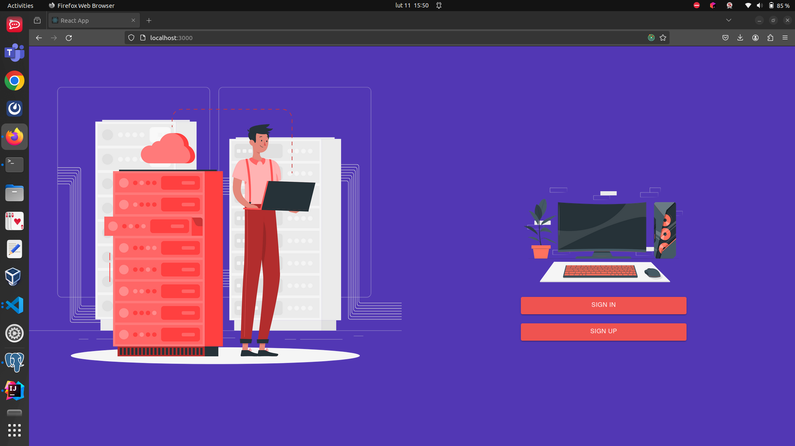

# todo_app
There are a lot of todo list basic apps, so I wanted to make it a little bit more challenging. I used Docker to download the images, build the PostgreSQL container, Java&Spring container and React container.

# Things I learned
 - Docker
 - Spring (JWT, CORS)
 - got a little bit more familiar with React

# Things to improve
 - responsiveness
 - appearance
 - prepare more functionalities

# Screens
 

